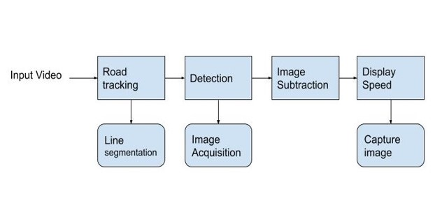
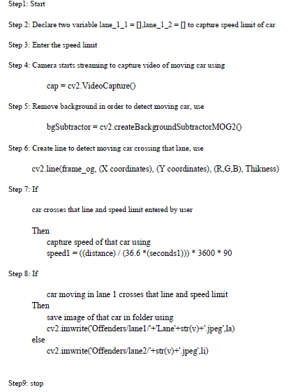
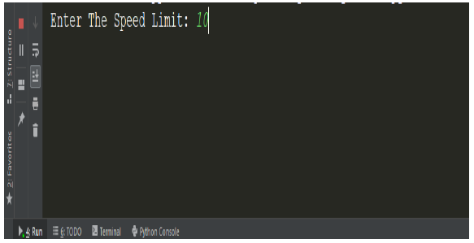
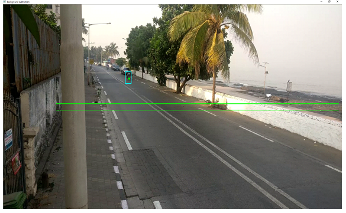
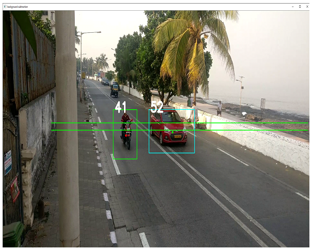
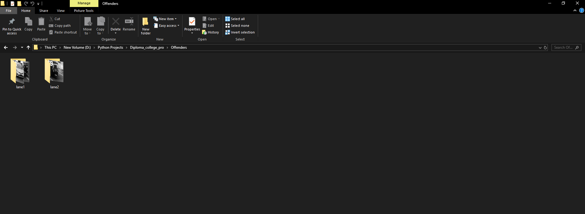
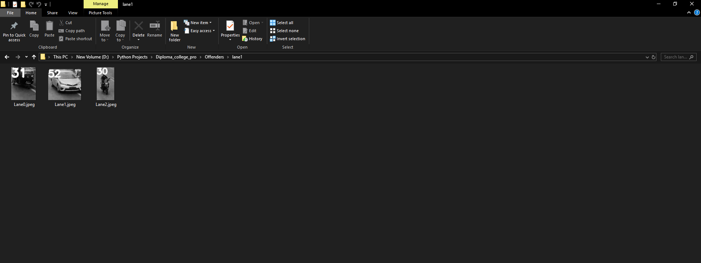
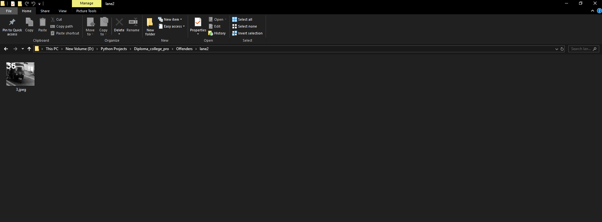

# Speed-Detection-Using-OpenCV

This project was build for my last year Diploma project.

It is written in [Python](https://www.python.org/) and uses [OpenCV](https://opencv.org/) 

In this proposed system, the speed of a vehical is detected with the help of a camera. 

It captures the image and give the speed of the vehical.

It stores the image of the Offenders in the folder who have crossed the speeed limit. Hence this system is implemented to eliminate the manpower involved and make the system fully automated.


# Working




In the working model the road is divided into two lanes using image segmentation. So it will capture the images of vehical from both the lanes. 
The vehicals are detected using image acquisition and a border is displayed on vehical and the speed of the vehical is displayed. 

If the speed of the vehical is greater than the speed limit, the image of that vehical is captured and stored in Offender folder. It also stores the images according to lanes. eg: Lane_1, Lane_2


1. Offender Folder
   1. Lane 1
      1. Lane0.jpeg
      2. Lane1.jpeg
      3. Lane2.jpeg
   2. Lane 2
      1. 1.jpeg
      2. 3.jpeg
    

# System Requirement

## Software Requirement

1. Operating System : Windows 7, 8, 9 ,10, Linux, MacOS

2. Memory : Minimum - 512 GB,
         Maximum - 1 TB

3. RAM(Random Access Memory) : 3 GB

4. Python Version : 3.6

5. Editor: Sublime Text3, Atom, VS CODE, PyCharm

6. OpenCV Library
    ```
    pip install opencv-python
    ```

## Hardware Requirement

1. Video Camera
2. Fairly capable processing system


# AlGORITHM




# Output














